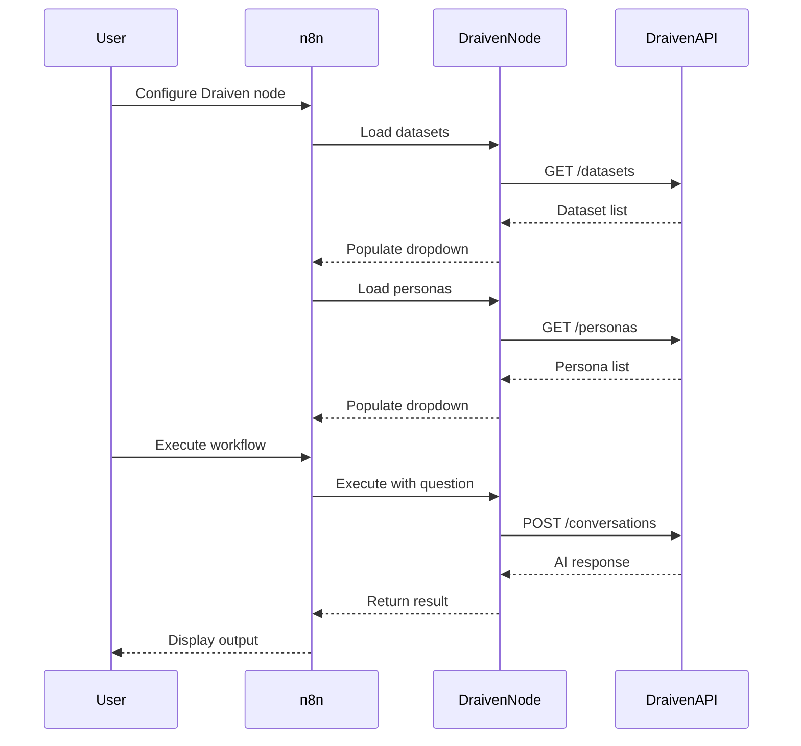

# Draiven n8n Node - Development Guide

## 📋 Overview

This n8n community node integrates Draiven AI into your n8n workflows, allowing you to:
- Ask questions to AI personas
- Analyze data from multiple datasets
- Get AI-powered insights directly in your automations

## 🏗️ Project Structure

```
draiven-n8n-node/
├── credentials/
│   └── DraivenApi.credentials.ts    # API authentication
├── nodes/
│   └── Draiven/
│       ├── Draiven.node.ts          # Main node implementation
│       └── draiven.svg              # Node icon
├── package.json                      # Package configuration
├── tsconfig.json                     # TypeScript configuration
├── gulpfile.js                       # Build scripts
├── setup.sh                          # Setup script
└── README.md                         # User documentation
```

## 🚀 Quick Start

### 1. Setup

```bash
cd draiven-n8n-node
./setup.sh
```

Or manually:

```bash
npm install
npm run build
```

### 2. Local Testing

```bash
# Link the package locally
npm link

# In your n8n installation directory
npm link n8n-nodes-draiven

# Restart n8n
```

### 3. Using in n8n

1. Start n8n and create a new workflow
2. Search for "Draiven" in the node panel
3. Add credentials:
   - API URL: `https://api.draiven.io` (or your instance)
   - User Email: Your Draiven account email
   - API Key: Your API key from Draiven dashboard

## 🔧 Development

### Building

```bash
# Build once
npm run build

# Watch mode (auto-rebuild on changes)
npm run dev
```

### Linting

```bash
# Check for issues
npm run lint

# Auto-fix issues
npm run lintfix
```

### Code Formatting

```bash
npm run format
```

## 📡 API Integration

### Authentication

The node uses Basic Authentication:
- **Username**: User email
- **Password**: API key

The credentials are automatically encoded in Base64 and sent as:
```
Authorization: Basic base64(email:apikey)
```

### Endpoints Used

1. **GET /datasets** - Fetch available datasets
   - Used to populate the datasets dropdown
   - Returns: Array of dataset objects with id, name, description

2. **GET /personas** - Fetch available personas
   - Used to populate the personas dropdown
   - Returns: Array of persona objects with id, name, description

3. **POST /conversations** - Ask a question
   - Sends question with selected datasets and persona
   - Returns: Conversation response with answer

### Request/Response Flow



## 🎨 Node Configuration

### Parameters

1. **Operation** (required)
   - Currently: "Ask Question"
   - Extensible for future operations

2. **Datasets** (required)
   - Multi-select dropdown
   - Dynamically loaded from Draiven API
   - Allows selecting multiple datasets for analysis

3. **Persona** (required)
   - Single-select dropdown
   - Dynamically loaded from Draiven API
   - Determines the AI's expertise and tone

4. **Question** (required)
   - Text area (4 rows)
   - The question/prompt for the AI
   - Supports multi-line input

5. **Additional Options** (optional)
   - **Conversation ID**: Continue existing conversation
   - **Stream Response**: Enable streaming (future feature)

### Output Format

```json
{
  "success": true,
  "conversationId": "123",
  "question": "What are the top products?",
  "answer": "Based on the analysis...",
  "datasets": [1, 2, 3],
  "personaId": 5,
  "metadata": {
    "timestamp": "2026-01-29T10:00:00Z",
    // Additional response data
  }
}
```

## 🔒 Security

- API keys are stored securely by n8n
- Credentials are never logged or exposed
- All communication uses HTTPS
- Basic Auth header is generated on-the-fly

## 🧪 Testing

### Manual Testing

1. Set up credentials in n8n
2. Add Draiven node to workflow
3. Configure with test question
4. Execute and verify output

### Test Scenarios

- ✅ Valid credentials
- ✅ Multiple datasets selection
- ✅ Different personas
- ✅ Long questions
- ✅ Conversation continuation
- ❌ Invalid credentials
- ❌ Invalid dataset IDs
- ❌ Empty question

## 📦 Publishing

### To npm

```bash
# Login to npm (first time only)
npm login

# Publish
npm publish
```

### Version Management

```bash
# Patch version (0.1.0 -> 0.1.1)
npm version patch

# Minor version (0.1.0 -> 0.2.0)
npm version minor

# Major version (0.1.0 -> 1.0.0)
npm version major
```

## 🐛 Troubleshooting

### Node not appearing in n8n

- Ensure `n8n` object in package.json is correct
- Verify build output exists in `dist/`
- Check n8n logs for errors
- Restart n8n after changes

### Authentication failures

- Verify API key is valid
- Check API URL is correct
- Ensure user email matches API key owner
- Test credentials using the test endpoint

### Dynamic options not loading

- Check network connectivity to API
- Verify credentials are saved
- Check browser console for errors
- Ensure API returns correct format

## 🔄 Future Enhancements

### Planned Features

1. **Additional Operations**
   - Get conversation history
   - List conversations
   - Delete conversation
   - Update persona settings

2. **Advanced Options**
   - Custom AI model selection
   - Temperature control
   - Max tokens limit
   - Response format options

3. **Batch Operations**
   - Ask multiple questions
   - Analyze multiple datasets separately
   - Compare persona responses

4. **Webhooks**
   - Receive async responses
   - Real-time streaming integration
   - Notification on completion

## 📚 Resources

- [n8n Community Nodes Documentation](https://docs.n8n.io/integrations/community-nodes/)
- [n8n Node Development](https://docs.n8n.io/integrations/creating-nodes/)
- [Draiven API Documentation](https://api.draiven.io/docs)
- [Draiven Platform](https://app.draiven.io)

## 🤝 Contributing

1. Fork the repository
2. Create a feature branch
3. Make your changes
4. Test thoroughly
5. Submit a pull request

## 📝 License

MIT License - see LICENSE file for details

## 💬 Support

- Email: support@draiven.ai
- GitHub Issues: [Report a bug](https://github.com/draiven-io/n8n-nodes-draiven/issues)
- Draiven Docs: [docs.draiven.io](https://docs.draiven.io)
